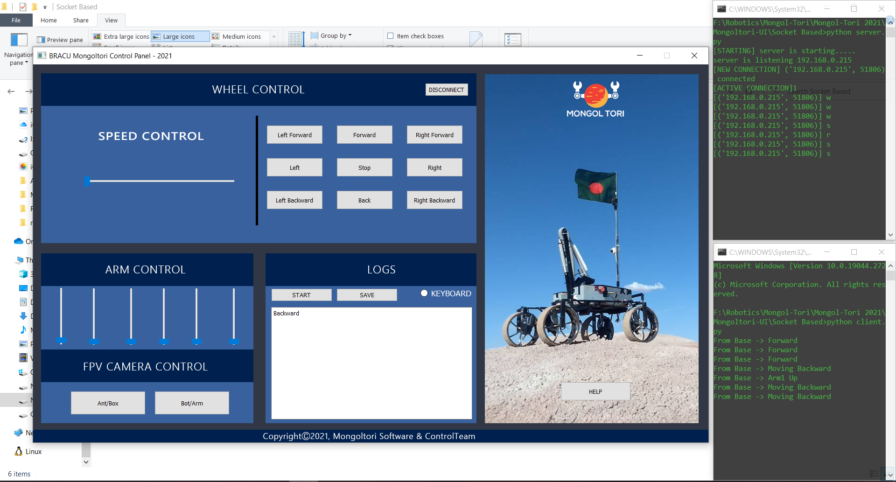

# BRACU-Mongoltori-GUI
BRACU Mongol Tori is a next-generation Mars rover that will one day work alongside human explorers on the red planet. 

```
pip install -r requirements.txt
```
### How to Run?
1. At first run server.py -> On Rover
2. Run client.py -> GUI on Base Station

### Preview

